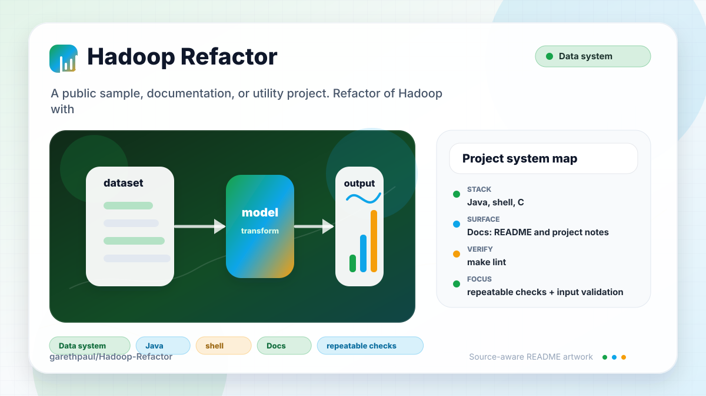

# Hadoop-Refactor

<!-- README-OVERVIEW-IMAGE -->


## Overview

`garethpaul/Hadoop-Refactor` is a public sample, documentation, or utility project. Refactor of Hadoop with compression

This README is based on the checked-in source, manifests, scripts, and repository metadata on the `master` branch. The project language mix found during review was: Java (29), shell (4), C (2), C/C++ headers (2).

## Repository Contents

- `CHANGES.md` - concise history of maintenance changes
- `Makefile` - local verification entry point
- `README.md` - project overview and local usage notes
- `build.xml` and `ivy.xml` - legacy Ant/Ivy build metadata
- `ivy` - source or example code
- `lib/hadoop-core-0.20.2-cdh3u1.jar` - checked-in legacy Hadoop dependency
- `scripts/check-baseline.py` - static legacy build verifier
- `SECURITY.md` - security reporting and disclosure guidance
- `src` - source or example code
- `VISION.md` - project direction and maintenance guardrails

Additional scan context:

- Source directories: ivy, src
- Dependency and build manifests: build.xml, ivy.xml, ivy/libraries.properties
- Entry points or build surfaces: `make check`, `ant test` in a matching legacy environment
- Test-looking files: src/test/com/hadoop/compression/lzo/TestLzoCodec.java, src/test/com/hadoop/compression/lzo/TestLzoRandData.java, src/test/com/hadoop/compression/lzo/TestLzopInputStream.java, src/test/com/hadoop/compression/lzo/TestLzopOutputStream.java, src/test/com/hadoop/mapreduce/TestLzoTextInputFormat.java, src/test/data/0.txt, src/test/data/100.txt, src/test/data/1000.txt, and 2 more

## Getting Started

### Prerequisites

- Git
- Python 3 for local static verification
- Java 8 is sufficient for the static baseline used here
- Ant, Ivy, native LZO headers/libraries, and a Hadoop 0.20/CDH3-compatible environment for full legacy builds

### Setup

```bash
git clone https://github.com/garethpaul/Hadoop-Refactor.git
cd Hadoop-Refactor
```

The checked-in Ant build targets Java 6 bytecode and uses legacy Hadoop 0.20/CDH3-era APIs. Use a matching Ant/Ivy/native LZO toolchain before treating full `ant test` results as authoritative.

## Running or Using the Project

- `build.xml` is the legacy build entry point.
- `src/java` contains the Hadoop/LZO Java implementation.
- `src/native` contains the native LZO build scripts and C bindings.

## Testing and Verification

Run the local static baseline:

```bash
make lint
make test
make build
make check
```

The `lint`, `test`, and `build` targets currently delegate to the static
baseline so every local gate entry point runs the same checks. The baseline runs
`scripts/check-baseline.py`, validates Ant/Ivy XML, checks shell syntax for
native packaging scripts, verifies the Java/native/test source inventory, and
confirms the checked-in Maven/Ivy download endpoints use HTTPS. It does not
require Ant.
It also exercises `src/native/packageNativeHadoop.sh` with temporary native
library fixtures and `src/get_build_revision.sh` with archive-export fixtures
so quoted path handling stays covered. The Java smoke harness also checks
`LzoIndex` empty-index alignment and malformed index byte counts without
requiring the full Ant test path. It also checks malformed index positions so
negative or non-increasing block offsets are rejected before split alignment
uses them. It also checks oversized LZO block sizes so corrupt streams are
rejected before indexers or split readers seek across the file. Compressed
lengths larger than their declared uncompressed lengths are also rejected
before checksum selection, allocation, or seeking. File-controlled lzop
extra-header fields are bounded and checksum-validated through a fixed-size
streaming buffer rather than a file-sized allocation.
Block parsing also rejects missing or partial terminators, unknown header
flags, decompressor output beyond the declared size, and final checksum
mismatches before accepting end-of-stream.
Positive-length Lzop reads that return zero bytes fail closed instead of
spinning indefinitely.
Close-time Lzop decompression rejects zero progress so malformed streams cannot hang cleanup.
Lzop output close independently cleans up its data and index streams and
returns the pooled compressor while preserving the first IOException.
Read-time Lzop decompression rejects zero progress without an input request so malformed streams cannot hang normal reads.
Missing index files fall back to unsplittable reads
while non-missing index open failures still surface to callers. Temporary index
rename failures are surfaced and
cleaned up so failed index publication cannot look successful. The same checked
publication path is used by direct and distributed index generation.
Distributed input traversal failures also propagate to the command instead of
being logged and converted into an empty successful indexing run.
GitHub Actions installs Python 3.12 and Temurin Java 8 with pinned actions,
credential-free checkout, and read-only permissions, then runs the same
deterministic `make check` baseline.

For full legacy verification in a matching environment, run:

```bash
ant test
```

When the required SDK or runtime is unavailable, use static checks and source review first, then verify on a machine that has the matching platform toolchain.

## Configuration and Secrets

- No required secret or credential file was identified in the repository scan. If you add integrations later, keep secrets out of git.

## Security and Privacy Notes

- Review changes touching network requests, sockets, or service endpoints; examples from the scan include build.xml, ivy/ivysettings.xml, ivy.xml, src/java/com/hadoop/compression/lzo/CChecksum.java, and 6 more.
- Review changes touching file, media, JSON, XML, CSV, OCR, or data parsing; examples from the scan include build.xml, ivy/ivysettings.xml, ivy.xml, src/get_build_revision.sh, and 4 more.
- Keep LZO block-size validation explicit for index generation, split readers,
  and stream decompression because compressed files may be untrusted input.
- Keep LZO index position validation explicit so corrupt sidecar indexes cannot
  provide negative or non-increasing block offsets.
- Review changes touching shell execution, subprocess, or dynamic evaluation; examples from the scan include src/native/config/ltmain.sh.
- Review changes touching database, model, or persistence code; examples from the scan include build.xml.

## Maintenance Notes

- See `SECURITY.md` for vulnerability reporting and safe research guidance.
- See `VISION.md` for project direction and contribution guardrails.
- Run `make lint`, `make test`, `make build`, and `make check` before pushing
  changes to build metadata, native scripts, Java source, tests, or dependency
  download configuration.
- Every Make verification target derives the checkout root from the loaded
  Makefile, so an absolute Makefile path works from any working directory.
- See `docs/plans/2026-06-08-native-packaging-guard.md` for the current native packaging guardrail.
- See `docs/plans/2026-06-08-build-revision-helper-guard.md` for the current build revision helper guardrail.
- See `docs/plans/2026-06-09-lzo-index-open-failure-guard.md` for the LZO index open failures guardrail.
- See `docs/plans/2026-06-09-lzo-index-position-order-guard.md` for malformed
  LZO index positions.
- See `docs/plans/2026-06-09-lzo-block-size-boundary.md` for the oversized
  LZO block-size guardrail.
- See `docs/plans/2026-06-09-lzo-index-rename-failure-guard.md` for temporary
  LZO index rename failures.
- See `docs/plans/2026-06-10-distributed-index-rename-guard.md` for the shared
  direct and distributed index publication guard.
- See `docs/plans/2026-06-12-distributed-input-error-propagation.md` for the
  distributed input traversal failures guard.
- See `docs/plans/2026-06-09-make-gate-aliases.md` for local verification
  target guardrails.
- See `docs/plans/2026-06-10-ci-baseline.md` for the hosted GitHub Actions
  baseline.
- See `docs/plans/2026-06-15-lzop-close-progress.md` for bounded close-time
  decompressor draining.

## Contributing

Keep changes small and tied to the project that is already present in this repository. For code changes, document the toolchain used, avoid committing generated dependency directories or local configuration, and update this README when setup or verification steps change.
